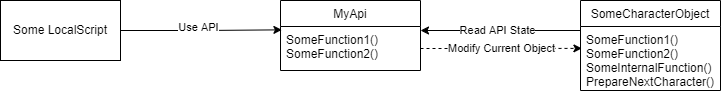
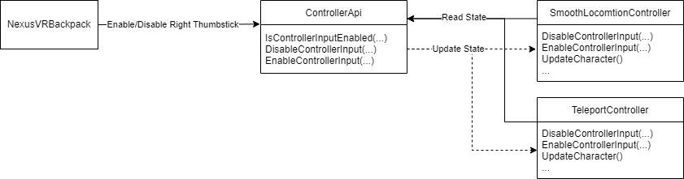

# API Design
This document covers the recommended design for exposing APIs
through Neuxs VR Character Model. See [included-apis.md](included-apis.md)
for the APIs that are included.

# Problem (V.2.3.X and Earlier)
Earlier versions of Nexus VR Character Model do not have
a proper, long-term solution for managing APIs. Changing
internal parts of Nexus VR Character Model, including
adding new control methods and reading settings, requires
knowing about and relying on the internal structure of
the modules. This risks breaking games in the future if the
structure has to change for new features.

# Solution
With Nexus VR Character Model V.2.4.0, a new `Api` module
was introduced to centralize functions and properties
that are controlled by sub-modules and add-ons
[such as Nexus VR Backpack](https://github.com/TheNexusAvenger/Nexus-VR-Backpack).
Any API should be referenced through `require(game:GetService("ReplicatedStorage"):WaitForChild("NexusVRCharacterModel").Api`
or equivalent. The `Api` value is guaranteed to exist
when the module is `require`d or is guaranteed to be
`nil` if it is an older version.

## API Helper Functions/Events
Any registered APIs can be indexed directly after being
registered without going through any helper functions for
reading. [See the included APIs for the helper functions](./included-apis.md#referencing-apis).

## Proxy Object Design
The obvious way to register an API is to register an object
that directly handles the object. However:
- This only works if the object is persistent. Ephemeral
  objects won't work because `Register` will block attempts
  to overwrite an API. This is meant to provide safety for
  the object providing the API randomly changing.
- More APIs may be exposed than desired. This could lead
  to a game relying on APIs that were never meant to be
  public, either leading to the component breaking with
  an update or the game-breaking with an update.
- Multiple components may want to register the same API.
  Controllers and cameras are examples.
- APIs that depend on objects that don't exist from the
  the start will lead to requests to APIs yielding longer than
  they should.

Using a proxy object for APIs resolves this issue at the
cost of being more complex. A simple example would be the following:

In the above example, a static API is provided and is
internally used by an object specific to a character
with internal functions that aren't meant to be used
externally. While a theoretical example works, consider
the controllers. Nexus VR Backpack will need to disable
the right controllers when the backpack is opened and
re-enable when closed. There is more than 1 controller,
and all of them contain functions not meant to be used
externally. The setup looks like the following:

Also, notice with the examples above that the external
API calls do not have to rely on the internal structure
of both what the API controls and where the functions
are even stored. Currently, Nexus VR Backpack would need
to rely on the specifics of the `ControlService` to work.

# Design Benefits
- Exposed APIs remove the reliance on the underlying structure
  of the modules and expose only what is meant to be public.
- Add-ons like Nexus VR Backpack can interact with Nexus VR
  Character Model as well as store API in a similar way.

# Design Drawbacks
- This does not work with pre-V.2.4.0 releases. Add-ons need
  to either design to limit features or not work if a static
  version or a fork is used.
- `Api` not existing is easy to check, but sub-APIs aren't.
  APIs like those in Nexus VR Backpack depend on being loaded.
- Any exposed API of the internal modules risks locking in
  certain designs that are hard to work around in the future.
  Not everything should be exposed unless requested to mitigate
  this.
- Reliance on APIs of Nexus VR Character Model will increase
  vendor lock-in with the system. If an alternative system
  were to exist - including by Roblox - removing Nexus VR
  Character Model will become harder for the game or system
  developer.
- The recommended setup of proxy objects is more complex and
  most likely won't be followed by add-ons.
- Sub-APIs won't follow a standard. No helper function, properties,
  or events are guaranteed to exist. The API type also can't
  be guaranteed.